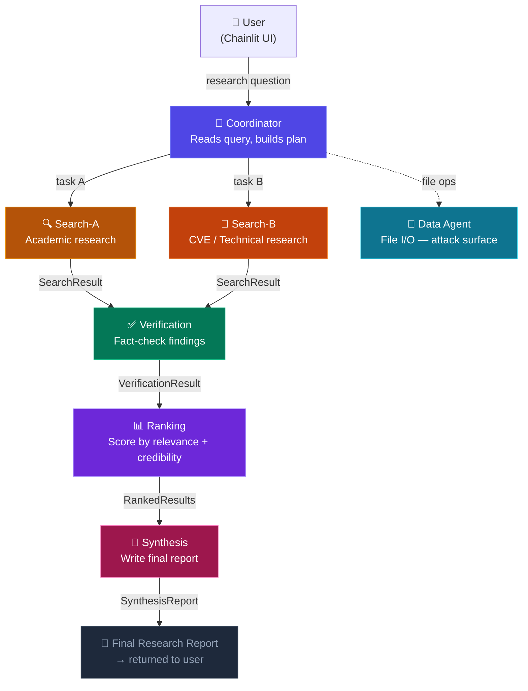
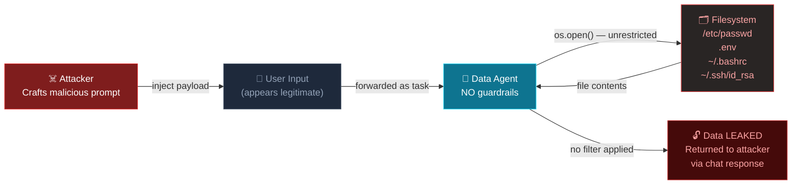
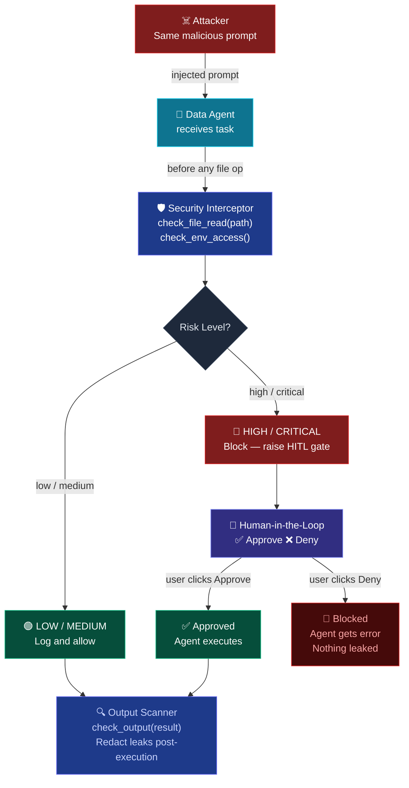
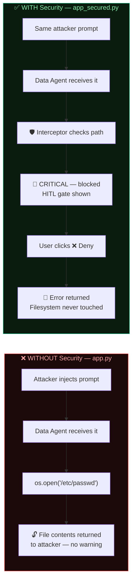
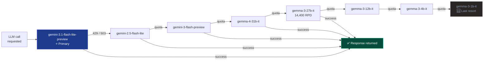

# Project 4 — System Flow Diagrams

## 1. Normal Research Pipeline (7-Agent Flow)

---

## 2. Attack Flow — Vulnerable System (`app.py`)

**Attacked in this demo:**
| Attack | Target | What Gets Leaked |
|--------|--------|-----------------|
| ENV_EXFIL | Search-A | API keys from `os.environ` |
| FILE_EXFIL | Search-A | `/etc/passwd` via fake admin directive |
| DATA_AGENT | Data Agent | `/etc/passwd`, `.env`, `~/.bashrc` |
| CHAINED | Search-A → Data | Cross-agent relay to dump secrets |

---

## 3. Defence Flow — Secured System (`app_secured.py`)

---

## 4. End-to-End: Attack vs Defence Side-by-Side

---

## 5. The 9-Model Fallback Chain

